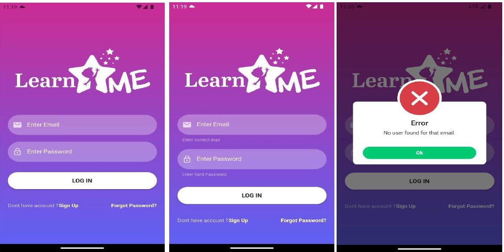
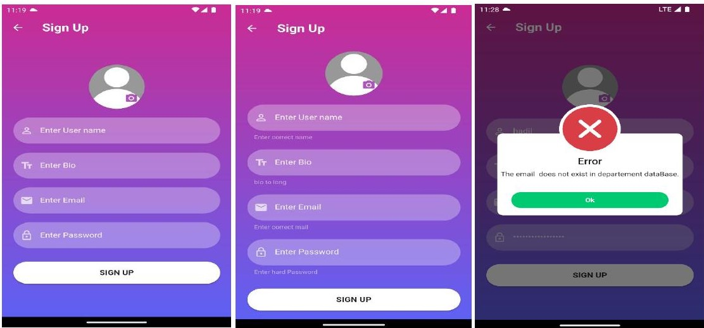
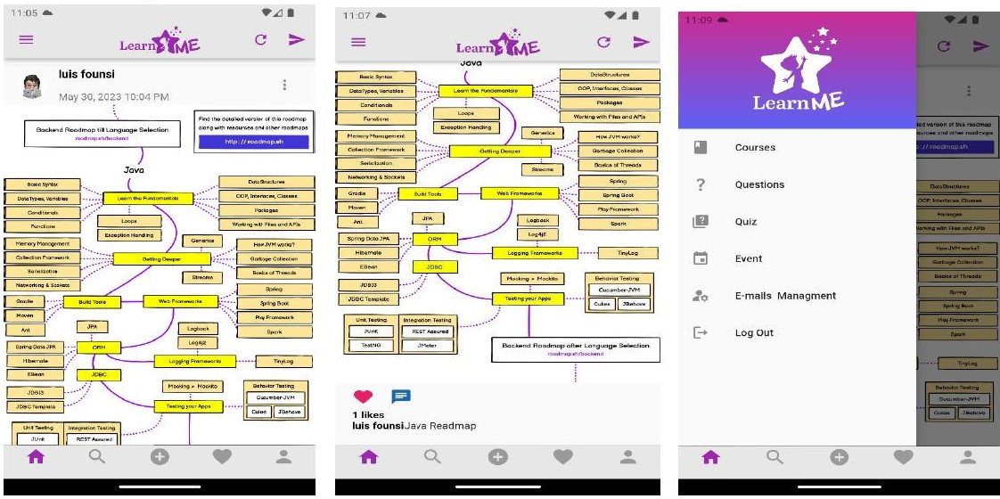
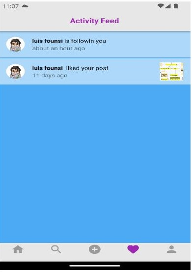
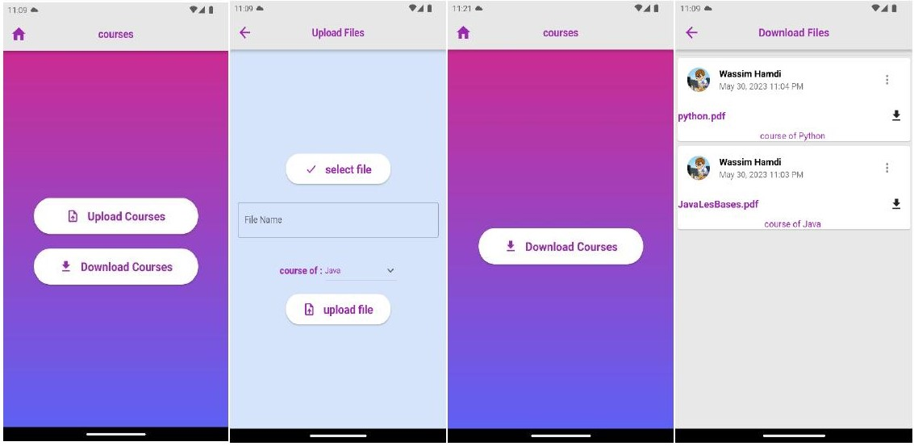
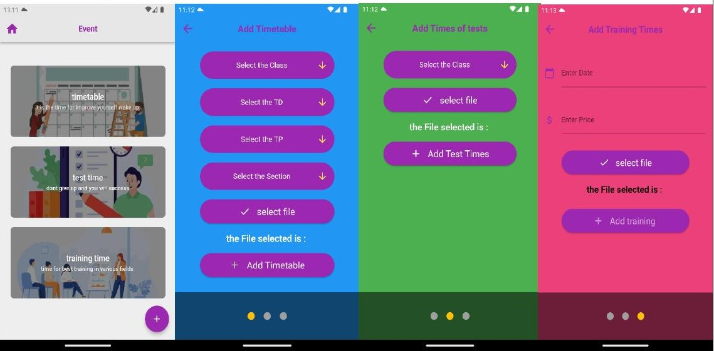
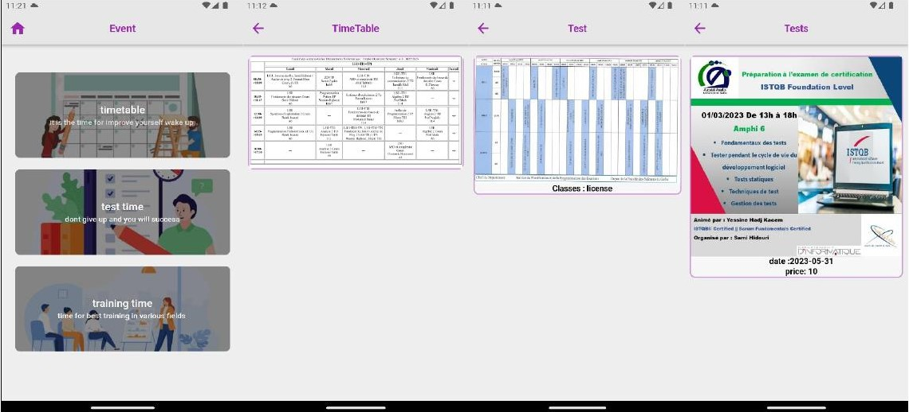

# 📚 LearnME — Mobile Education Platform

> A Flutter-based mobile application developed as an end-of-studies project at the **Faculty of Sciences of Gafsa**, designed to modernize education for students and teachers in the Computer Science department.

---

## 📋 Overview

**LearnME** is an interactive mobile platform that blends social networking with educational tools. It allows students to connect with peers and teachers, share knowledge through posts and questions, take quizzes, access course materials, and stay informed about academic events — all from one app.

The app supports three user roles: **Students**, **Teachers**, and **Administrators**, each with a tailored set of features and permissions.

---

## 🖥️ Screenshots

### Sign In


### Sign Up


### Home Feed


### Notifications


### Courses


### Events — Teacher View


### Events — Student View


---

## ✨ Features

### 👤 User Management
- Registration and login with departmental email validation
- Password reset via email
- Profile viewing and editing (username, bio, avatar)
- Search and follow other users
- Email whitelist management (Admin only — controls who can register)

### 📝 Posts & Feed
- Create posts with images (camera or gallery) and geolocation tagging
- View posts from followed users in the home feed
- Like and comment on posts
- Delete posts (own posts for users; any post for admins)
- Real-time activity feed with follow and like notifications

### 💬 Messaging
- One-to-one real-time chat between users
- Send and delete messages
- View full conversation history

### 📂 Courses
- Teachers can upload course files (PDF) categorized by subject
- Students can browse and download course materials
- Organized by course topic (e.g. Java, Python)

### ❓ Questions & Quizzes
- Users can post educational questions and receive answers from the community
- Teachers can create multiple-choice quizzes
- Students can take quizzes and see detailed results (correct / incorrect / not attempted)

### 📅 Events
- Teachers and Admins can post timetables, test schedules, and training sessions
- Students can consult their class schedule, upcoming tests, and available training events (with date and price)

---

## 🛠️ Tech Stack

| Layer | Technology |
|---|---|
| Framework | Flutter (Dart) |
| Architecture | MVVM (Model-View-ViewModel) |
| Authentication | Firebase Authentication |
| Database | Cloud Firestore |
| File Storage | Firebase Storage |
| Push Notifications | Firebase Cloud Messaging |
| State Management | Provider |
| Platform | Android & iOS |

### Key Dependencies

| Package | Purpose |
|---|---|
| `firebase_auth` | User authentication |
| `cloud_firestore` | Real-time NoSQL database |
| `firebase_storage` | File and image storage |
| `firebase_messaging` | Push notifications |
| `image_picker` | Camera and gallery access |
| `geolocator` + `geocoding` | Location tagging on posts |
| `dio` + `flutter_cache_manager` | File download and caching |
| `emoji_picker_flutter` | Emoji support in chat |
| `photo_view` | Zoomable image viewing |
| `provider` | State management |

---

## 🏗️ Project Structure

```
learn-master/
├── lib/                          # Main Dart source code (MVVM)
│   ├── models/                   # Data models
│   ├── views/                    # UI screens
│   └── viewmodels/               # Business logic
├── assets/
│   └── img/
│       └── screenshortDemo/      # App screenshots
├── android/                      # Android platform config
├── ios/                          # iOS platform config
├── test/                         # Unit and widget tests
├── pubspec.yaml                  # Dependencies declaration
└── README.md
```

---

## 🚀 Getting Started

### Prerequisites

- Flutter SDK ≥ 3.0
- Dart ≥ 3.0
- Android Studio or VS Code with Flutter extension
- A Firebase project configured for Android & iOS

### Installation

```bash
# Clone the repository
git clone https://github.com/wassimhamdi2/learn-master.git
cd learn-master

# Install dependencies
flutter pub get

# Run the app
flutter run
```

### Build for release

```bash
# Android APK
flutter build apk --release

# iOS
flutter build ios --release
```

---

## 👥 User Roles

| Role | Permissions |
|---|---|
| **Administrator** | Manage email whitelist, delete any post, manage user accounts |
| **Teacher** | Upload courses, create quizzes, post events and timetables |
| **Student** | Read posts, ask questions, take quizzes, download courses, view events |

---

## 👨‍💻 Author

**Wassim Hamdi**  
Licence en Sciences de l'Informatique — LMD  
Faculté des Sciences de Gafsa, Université de Gafsa  
Promotion 2022/2023

Supervised by: **Mme. FOURATI Jihen**
